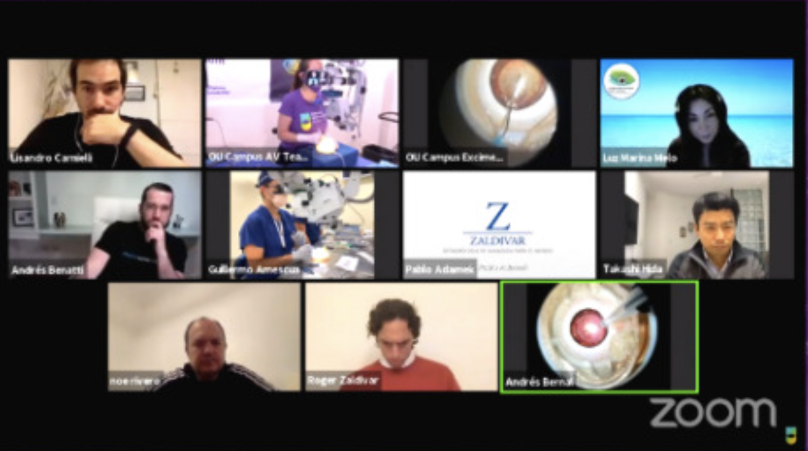

A new concept of Hybrid Blended Education from <a href="https://oftalmouniversity.com/" class="links_post" target="t_blank">Ophtalmo University</a> OftalmoUniversity is shaping the future of ophthalmology! The #OUCampusCDMX is merging the Virtual Campus and the On-Site Campus to offer a new way of <b>learning, adapted for remote access to medical education through online tools</b>.

The September 2020 Premiere brought together over 800 participants and top instructors from different countries, all connected via Zoom, to join this first-of-its-kind campus. The procedures performed on <a href="https://www.bioniko.com/" class="links_post" target="t_black"> Bioniko Eyes </a> were streamed live during the webinar from smartphones connected to microscopes through MicroREC optical systems.

</img>

Thanks to German lenses and innovative engineering, the <a href="https://microrec.customsurgical.co/" class="links_post" target="t_blank">MicroREC</a> enables smartphones to capture high-quality images and videos from microscopes. Doctors can stream them live in webinars, share them with colleagues in online groups, messaging apps, or social media, and even use them for telemedicine.

We were thrilled to be a partner in this event and offer one MicroREC Kit as a prize in the contest held for the participants! OftalmoUniversity’s initiative revolutionizes medical education in ophthalmology by involving top talents and technologies.

We would like to congratulate OftalmoUniversity on bringing the concept of hybrid education forward and for the impeccable organization of a great webinar! We look forward to the next one!
