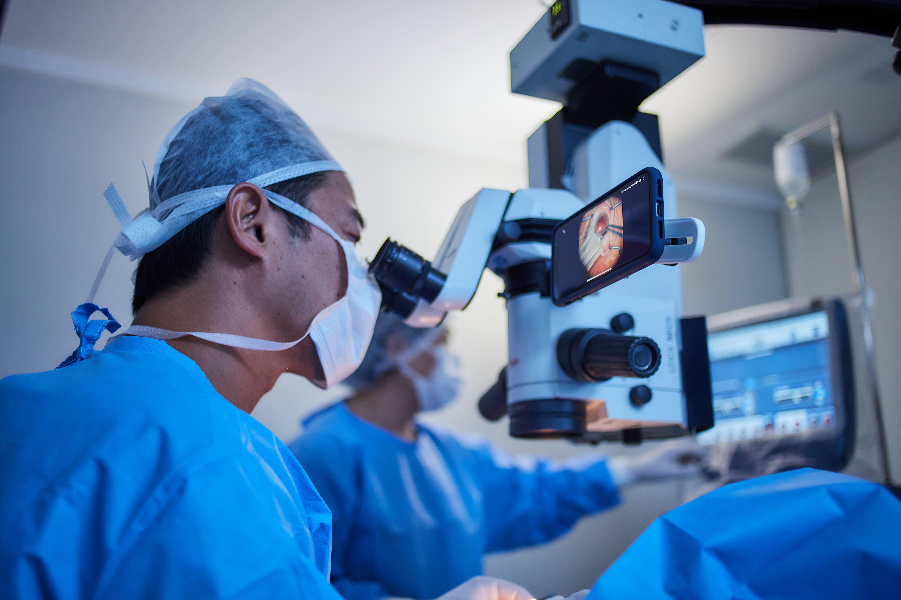
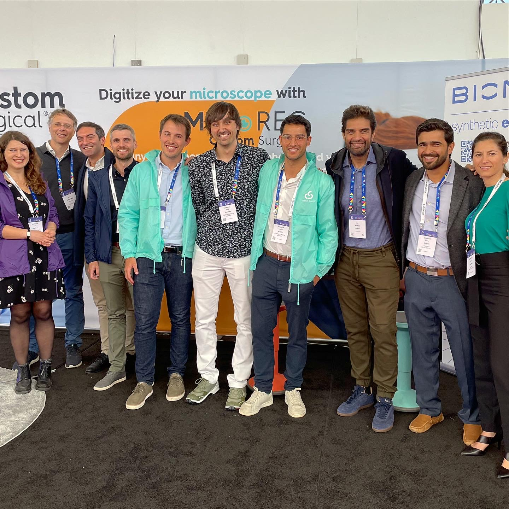

Custom Surgical is finishing 2021 with 13 team members, distributors in 22 countries and customers in more than 50 countries. Our year was very intense, full of growth and insights, and in general - successful.

We grew up, strengthened our team, improved our systems and established many new connections. While we start 2022 on a firm note and wish everybody to make it your year, we’re so excited to sum up 2021 and review its highlights. Welcome to join us in that journey!

<h2><b> January - strategizing</b></h2>

Our January started from a lovely post of doctor Ike Ahmed where he mentors his student doctor Ticiana de Francesco from the comfort of his own home. It was so inspiring to see how MicroREC can help in telemedicine and support our mission of improving patient coverage.

Inspiration from doctor Ike Ahmed and other surgeons from all over the world motivated us to work even harder to complement our mission. In January, we set up our goals, decided on our strategy, and set up foundations for a <b>few successful hires in our team.</b>

<h2><b> February - enabling e-commerce</b></h2>

In February, we were happy to welcome Marc Frigola to our team. Mark took over our digital sales and made customer experience online more comfortable and agile.

Plus, we enabled online sales on our website - to give access to affordable MedTech to people from all over the world. It became much easier for customers from any country to purchase our product and for us - optimize access to our equipment.

<h2><b>March - MicroREC Android app</h2></b>

In March, we launched our Android app for MicroREC. The app was aimed to improve the shooting experience in operating rooms. Regular photo apps don’t allow you to adjust focus from fingers or instruments on pupils and mix up medical imagery with personal files in a camera roll. MicroREC app, only available on iOS, helped tackle this issue for Android users, too. Plus, we participated in START Global Competition, received the first MicroREC user cases from dentists, and welcomed a marketing manager Yuliia Zakutnia to our team - yay!

<h2><b>April - universal smartphone holder</h2></b>

In April, we received quite some additions to MicroREC hardware. First, we launched a beam splitter compatible with Leica microscopes and slit lamps. Second, we replaced our custom cases with a universal smartphone holder - one holder to fit all phone models and therefore, allow doctors to use many smartphones with their MicroREC without spending extra. Plus, we tested MicroREC in ENT and figured out it’s very suitable for ENT specialists, too.

<h2><b>May - updated app</h2></b>

</img>

In May, we carried out many user testing sessions and updated the MicroREC app to make sure it fits the needs of surgeons. The updated MicroREC app enabled choosing the video recording quality, seeing recording time, and disabling audio.

<h2><b>June - leveraging marketing strategy</h2></b>
In June, we doubled on our marketing strategy and organized our first photo shoot ever. We’re so thankful to our representatives in Brazil and the doctors who allowed us to take pictures in an operating room and a training center. Plus, in June we made it to the semi-final of the Boston Scientific CPC VI and welcomed software developer Miroslav Brezik to our team.

</img>

<h2><b>July - seed financing round</h2></b>

July was a very intense month for us since we finished our seed financial round. Plus, in partnership with our great colleagues and friends Bioniko, we participated in ASCRS and met a lot of our happy customers in person.

<h2><b>August - Google Cloud Program</h2></b>

In August, we launched a new website that made the shopping experience for our customers even easier. Plus, we received support from the government in the form of “Start? Zuschuss!” Grant. However, one of the main highlights of August for us was the acceptance to Google Cloud for Startups Program in which we participate till now.

<h2><b>September - new hires</h2></b>

In September, 4 more team members joined Custom Surgical. Carolina Ruiz set up our supply chain and logistics, Rafael Azpurua took over our sales in Latin America and distributor relationships, Edgar Lopez supported our sales, and Jorge Rodríguez López joined our hardware team. Plus, we decided to make the MicroREC app available to everybody - to support our mission of making technology accessible to everybody.

<h2><b>October - ESCRS</h2></b>
We were looking forward to October since for the last few months we’d been prepping for the main event of the year for us - ESCRS in Amsterdam where we presented on our booth. Participation in ESCRS raised us to the next level since we were exhibiting along with other top companies in the sphere. <pre></pre>

</img>

Our booth and a small crew of 5 were occupied all the time, without having a moment to eat. Other exhibitors and representatives of big companies agreed our recording technology is great. We enjoyed seeing dr. Alja Crnej presentation in which many images were taken with MicroREC. Yet, the most exciting part for us was meeting so many customers, supporters, and doctors interested in MicroREC. We had an incredible moment at ESCRS and are looking forward to the next show.

<h2><b>November - team meeting</h2></b>

In November, we had our first ever offline team meeting. Working as a distributed team might be challenging sometimes, so we enjoyed coming to Munich to get to know each other, present the work of different departments and align on goals. Plus, we flew to the USA to participate in AAO with our partners Bioniko, participated in Bay Startup Demo, and started personal demos in clinics in Venezuela.

<h2><b>December - cooperations with clinics</h2></b>

To sum up the year, we finished a few important projects in December. In particular, we updated the MicroREC app with new designs and functionalities, both on iOS and Android. We received Digital Top-50 awards. Also, we started demos for large clinics in Spain and made a few useful partnerships. In particular, the Clinic Eye Training Center is using 6 MicroRECs for educational purposes, and another 5 MicroRECs will go on the expedition to Dakar (Senegal) from 8th until 16th of January, with Fundación Elena Barraquer.
What a year! We hope your 2021 was as exciting as ours. We thank you for being with us and checking on our progress. We hope to keep in touch in 2022 and we wish you all the best in the new year. Hope it will bring you a lot of joy, happiness, and great moments with your loved ones. See you in 2022!
