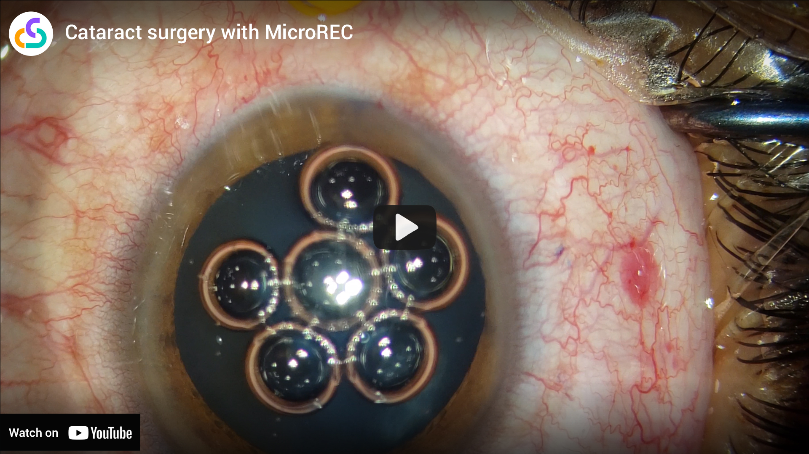

In the current ophthalmologic scenario, the devices available are too expensive and need experienced engineers for their installation. That's why diagnosis is centralized in big cities and big hospitals, which results in a lack of coverage in the diagnosis of the eye since trained surgeons also mainly live in big cities and cannot provide healthcare to people from distant or rural areas.
Imagine a world with democratic access to healthcare, where anyone can get access to proper optical imaging consultation. Did you imagine? So did we, and that's why we created Custom Surgical.

Custom Surgical wanted to change this reality by creating <b>affordable and clever medical imaging solutions</b>. Our goal is to ensure that every patient will always be diagnosed on time regardless of their location or economic resources. 
Our journey started in 2018, when we started with the prototypes and developments of MicroREC - <b>an optical system that digitizes your microscope or slit lamp</b>, allowing image recording or instant streaming that can be used, for example, during surgeries on your phone, without occupying the binoculars.

Until we reached custom-made optical systems for smartphone cameras (some people call phone adaptors for microscopes, but it is better than that!) and mobile software applications accessible to everyone, we had a Kickstarter campaign in the second quarter of 2019. In the next quarter, Custom Surgical was founded in Munich, Germany.

Record and broadcast microscopy imaging in every type of <b>phone is a revolution that can change medicine as we know it</b>. We allow better access to diagnosis by our affordable MedTechs that can be mixed with telehealth and telemedicine, making it possible to <b>receive instant advice from a mentor or a more senior colleague from anywhere</b>. With MicroREC, you can also record better quality, create 8k videos for self-improvement, presentations, or classes and even train using our AR tools soon on the market.

<a href="https://www.youtube.com/watch?v=QIgVxj8AbYA" target="_blank"></img></a>