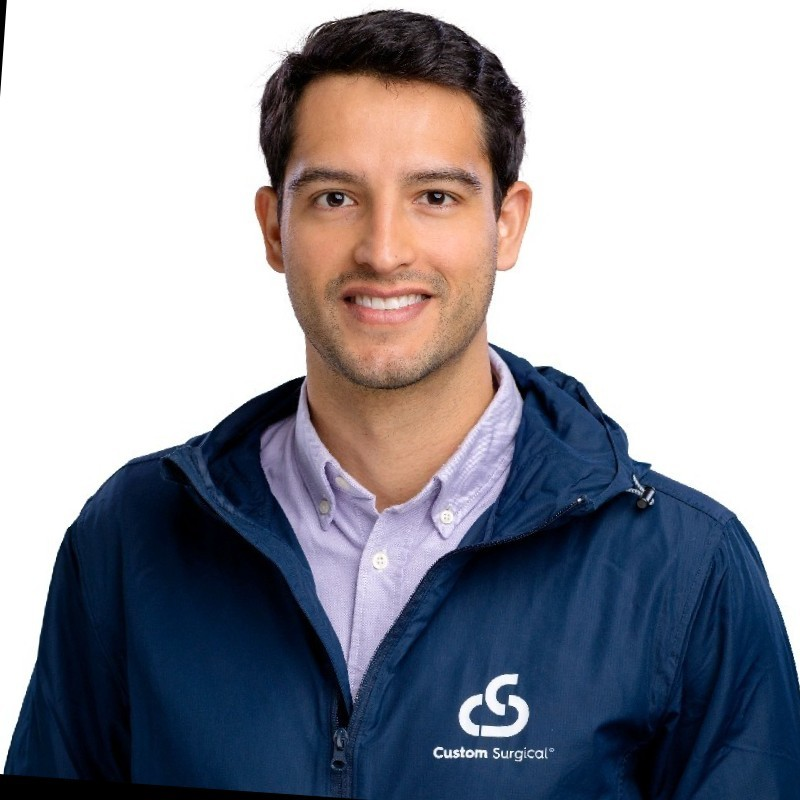

CUSTOM SURGICAL, one of 10 startups from around the world working with downtown Rochester’s Luminate accelerator at NextCorps, is helping to write Rochester’s
next chapter in history as the world’s center for optics, photonics, and imaging (OPI). Each company in Luminate’s Cohort 5 receives an initial investment of $100,000 and participates in the six-month
program, which helps the selected companies speed the commercialization of their technologies and businesses.

They will compete for up to $2 million in follow-on investment at Finals 2022 on October 19th at the Rochester Riverside Convention Center. Funding for the $25 million program is provided through Empire State Development’s Finger Lakes Forward Upstate Revitalization Initiative. “We now have more than 50 companies in the Luminate
portfolio collectively, working to bring the most innovative OPI applications to a variety of industries,” said Dr. Sujatha Ramanujan, managing director of Luminate. “Custom Surgical is a great example of how novel inventions can be applied to solve growing global healthcare challenges like blindness and vision. impairment.”

We caught up with Federico Acosta, Custom Surgical’s founder, to discuss how his company is modernizing surgery by providing an effective way to record, store, and share medical images and leverage them to diagnose and treat patients.

<b>Tell us about your company.</b>
At <a href="https://customsurgical.co" class="links_post">Custom Surgical</a>, we are digitizing medical microscopes with a smartphone-based platform and enhancing their functionalities with mobile applications. Our optical system, the MicroREC, allows ophthalmologists to connect any smartphone camera to the optical path of their microscope. Our data management platform allows them to easily store and share their videos and images on the cloud. We are also developing an Augmented Reality (AR) platform that helps ophthalmologists train during different surgical procedures and later on improve their surgi-
cal outcomes.

Currently, our products have been sold in 61 different countries through a large base of distributors and via licensing deals we have secured with major microscope manufacturers. Our software platform has been adopted
by more than 3,000 specialists and is acquiring data faster than any other platform in the market.

<b>Where is your company headquartered?</b>
Our headquarters is in Munich, Germany.

<b>Who are the company leaders?</b>
I founded Custom Surgical using my background in Mechatronics and biomedical computing engineering.
Together with Fernando Benito, Chief Technology Officer, and Carolina Ruiz, Supply Chain Manager, we lead a global team of 15 people from 10 different nationalities and various backgrounds.

<b>How did you and your team develop the concept for your product?</b>
I spent more than 10 years attending over 1,000 surgeries as a clinical specialist and product manager in several countries across Latin America, North America, and Europe. During that time, I realized that doctors lack tools to effectively communicate their work.

In particular, doctors operating the most complicated cases in remote locations had no means to document their procedures. I also saw that patients who were
diagnosed at a later stage of their pathology had low chances of recovering their vision, an unfortunate outcome that could be avoided.

These insights led to the development of MicroREC, along with a software platform that allows for automatic screening of patients using smartphones.

<b>Why does the world need this product?</b>
More than 80% of medical microscopes lack recording functionalities. Those that do are extremely expensive, cumbersome, and do not offer a friendly data-acquisition platform. This leaves doctors and other medical professionals struggling to capture the data they see through their microscopes. That data can lead to better, earlier detection of pathologies.

At Custom Surgical, we believe tools like smartphones will enable nearly instantaneous screening to detect pa-
thologies and advise consultation by specialists before it is too late. Our technology will dramatically decrease the number of patients suffering from avoidable blindness. This will have a huge impact. Every year, more people become blind because of pathologies that could have been treated if diagnosed at an early stage. Currently 43 million people are completely blind and almost 300 million have mild to severe vision impairments. These numbers are expected to almost double by 2050.

As our population grows and ages, we do not have enough specialists around the world to treat everyone that requires consultation. We are not training ophthalmologists at the same speed that the population is growing. In the future, the number of blind people in the world will continue to increase if we don’t do something about it.

<b>How long have you been working on this
technology?</b> 
The idea of the MicroREC originated in 2017 during a very well approached surgery that I was not able to record. A successful kickstarter campaign in 2019 launched the Mi-
croREC, followed by the launch of our software platform in 2021. Our sales continue to climb, and the current number of users has exceeded expectations.

</img>

<b>Who is the target audience for your product?</b>
We target every ophthalmologist around the world. Our hardware product can also be used by dentists, ENT special-
ists, and neurosurgeons, among other healthcare providers.

<b>What made you look to Rochester to further your product?</b>
Rochester is the perfect environment for our company. It has an amazing optics and photonics community, which has connected us to great companies that we are eager to work with. For example, Custom Surgical is now working with local resources on the manufacturing and development of our optical products. 

Additionally, the Rochester Institute of Technology is the perfect academia to work alongside our company. Its optics and informatics departments will be cru-
cial for future talent acquisition and academic research. The Flaum Eye Institute also provides us with valuable opportu-
nities to gather information from the users of our technology.

<b>Tell us about your experience being in Luminate.</b> 
Luminate provides us access to the Rochester community, training resources, and a mentor network that is invaluable at the current stage of our company. The more time we spend in Rochester and with the hospitable, hardworking
Luminate team, the more empowered we feel to continue our journey.

<b>What do you hope to achieve during your time in
Luminate?</b>
We hope to select partners to outsource our hardware manufacturing in the US, connect with ophthalmic insti- tutions like the Flaum Eye Institute, and secure our next financing round. The resources we receive from Luminate help us make more well-informed decisions to exponentially grow our business.

<b>If your company wins at Finals 2022, what do you
plan to do with the follow-on funding?</b>
Winning Luminate Finals will help us complete our expansion plans into the US. We hope it will help us to immediately start production in Rochester and launch a strong go-to-market strategy with the support of NY-basedcompanies like Launch Team Inc. Finally, we would be able to co-develop our AR training platform for young ophthalmologists in the US.

To receive updates from Luminate, including how to register to attend the free Finals 2022 event, please visit
<a href="https://luminate.org/#subscribe" target="t_blank" class="links_post">https://luminate.org/#subscribe</a>.

Posted from <a href="https://rbj.net/2022/07/22/luminate-spotlight-custom-surgical/" target="t_blank" class="links_post">Rochester Business Journal</a>.