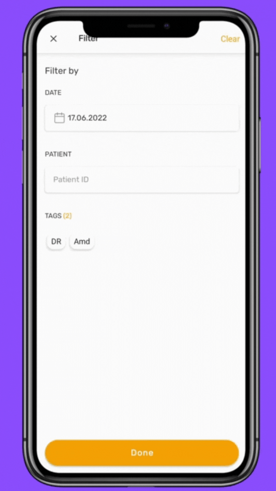

Recording your procedures on your phone is a must if you want practicality, improve your workflow, save time, and be connected. 

We already talked about <a href="https://blog.customsurgical.co/07-5-ways-to-use-MicroREC-as-a-working-tool/" target="t_blank" class="links_post">5 ways to use MicroREC as a working tool</a>

There you can understand some reasons why you should start doing it. 

Preparing your equipment ahead of the procedure can save time, increase your medical practice's efficiency, and focus on the most important thing: <b>your patients</b>. 

<h2 style="color:#FFA100">1) Adjust your settings before recording</h2 style="color:#FFA100">
You can also adjust the image settings to the OR conditions before recording, try as many options as you like, and find your preferred settings without having to make anyone wait. 

You won't need to edit it afterward. 

</img>

MicroREC app - settings

<h2 style="color:#FFA100">2) Manual Focus </h2 style="color:#FFA100">
You probably already had the experience of suddenly changing the focus from the eye to your hand to your instruments... Using an application that focuses on the eye and does not change is essential. It will improve your workflow because you won't need to care about it, and you will get better recordings of the important thing, the eye. 

<h2 style="color:#FFA100">3) Rotation</h2 style="color:#FFA100">
If you are using a recording system with a Beam Splitter, you will recognize that the position of the image rotated concerning what you see on the binoculars. Therefore, changing it on your phone is a must to be able to reproduce the video later in the same orientation. 

<h2 style="color:#FFA100">4) Save your professional recordings in a separate space</h2 style="color:#FFA100">
Mixing your personal and professional pictures can be an issue. For example, imagine you are trying to show a diagnosis to your patient, and suddenly you turn to your vacation pictures in Cancun. 

Having a safe space to add all your recordings in an organized way is necessary. 

<h2 style="color:#FFA100">5) Separate your recordings into separate folders </h2 style="color:#FFA100">
Save your patient ID, comment about the case, and add tags to reach it quickly whenever needed. Avoid losing any crucial information or mixing different patients. 

</img>

MicroREC app - separate folders

<h2 style="color:#FFA100">6) Personalize your watermark in seconds</h2 style="color:#FFA100">
Editing every video afterward could be a pain in the ass. You could personalize it before. Using the watermark, adding: 
<li>- Your name </li>
<li>- Patient ID </li>
<li>- Tags</li>
<li>- or custom your text</li>
 

</img>

MicroREC app - watermark

It is great to see the development of your patients in an organized place, being able to share with them or with your colleagues. It shows dynamism, professionalism, and better customer service.  
<a href="https://qrco.de/bcxWdp" target="t_blank" class="links_post">Download the last version of the MicroREC app here</a>. 
It is entirely free.