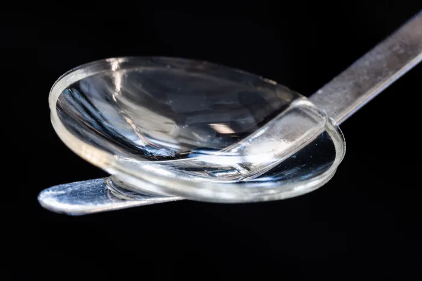

Loss of corneal transparency and poor refractive function are among the leading causes of blindness globally. Although corneal blindness can be treatable by transplantation, an estimated <b>12.7 million people await a donor cornea, with one cornea available for every 70 needed </b>(!!).

Access to corneal transplantation supposes a problem on many different fronts, from a limited supply of donor corneas, lack of infrastructure for tissue donation, risk of graft rejection...

To address these limitations, scientists from India and Iran developed cell-free synthetic corneas from type I collagen. They were able to restore the vision of 14 people who were visually impaired, due to advanced keratoconus, using the <b>bioengineered cell-free implantable medical device</b> to be used as a <b>substitute for human corneal tissue</b>.

<iframe
    class='iframe-instagram'
    src="https://www.instagram.com/reel/ChKf5cyMMLW/embed/captioned/"
    frameborder="0"
    scrolling="yes"
    allowtransparency
    height= "850"
    width="auto"
    minWidth="326"
    maxWidth="540"
    style="position: relative;
    left: 50%;
    transform: translate(-50%, 0);"
  ></iframe>

Post-Cornea transplantation recorded with MicroREC

The natural type I collagen was obtained from porcine skin, which has already been used in different medical devices for glaucoma surgery and wound dressing as a sustainable and cost-effective product. Furthermore, they developed compatible packaging and sterilization processes to make sure the synthetic corneas maintained their full properties and sterility products, even after two years of being in storage. This opens the possibility to access many rural areas and remote locations, where previously corneal blindness could not be treated.

<h2 style="color:#FFA100">This opens the possibility to access many rural areas and remote locations</h2>

Their research however didn't end up there, they developed a new minimally invasive surgery to treat keratoconus, which is suture-free and leaves the patient corneal intact, which promotes rapid wound healing.

No adverse event was observed after 24 months in any of the patients, and all 20 patients experienced restored vision and a restored ability to wear contact lenses.

<figure>

<figcaption style="text-align: center;">Thor Balkhed/Linköping University</figcaption>
</figure>

This opens a world of possibilities to treat corneal blindness without the long waiting list to obtain a donor cornea, plus, making it accessible in remote locations where storaging and tissue preparation facilities might not be as available.

The bioengineering implants can be shipped anywhere and stored in a refrigerator prior to use. This opens up the procedure to many centers and rural areas that do not have eye banks.

Follow us on Instagram for surgeon and diagnosis videos, ophthalmology news, and updates from our solutions:

<iframe
    class='iframe-instagram'
    src="https://www.instagram.com/p/CZdhKdWq7nY/embed/captioned/"
    frameborder="0"
    scrolling="yes"
    allowtransparency
    height= "850"
    width="auto"
    minWidth="326"
    maxWidth="540"
    style="position: relative;
    left: 50%;
    transform: translate(-50%, 0);"
  ></iframe>
