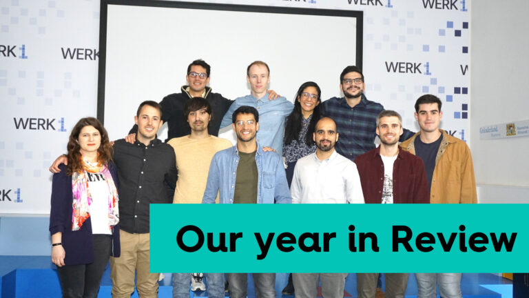

Custom Surgical is finishing 2021 with 13 team members, distributors in 22 countries and customers in more than 50 countries. Our year was very intense, full of growth and insights, and in general - successful. We grew up, strengthened our team, improved our systems and established many new connections. While we start 2022 on a firm note and wish everybody to make it your year, we’re so excited to sum up 2021 and review its highlights. Welcome to join us in that journey!

<h2><b>January - strategizing</b></h2>

Our January started from a lovely post of doctor Ike Ahmed where he mentors his student doctor Ticiana de Francesco from the comfort of his own home. It was so inspiring to see how MicroREC can help in telemedicine and support our mission of improving patient coverage. Inspiration from doctor Ike Ahmed and other surgeons from all over the world motivated us to work even harder to complement our mission. In January, we set up our goals, decided on our strategy, and set up foundations for a few successful hires in our team.

<h2><b>February - enabling e-commerce</b></h2>

In February, we were happy to welcome Marc Frigola to our team. Mark took over our digital sales and made customer experience online more comfortable and agile. Plus, we enabled online sales on our website - to give access to affordable MedTech to people from all over the world. It became much easier for customers from any country to purchase our product and for us - optimize access to our equipment.

<h2><b>March - MicroREC Android app</h2></b>

</img>